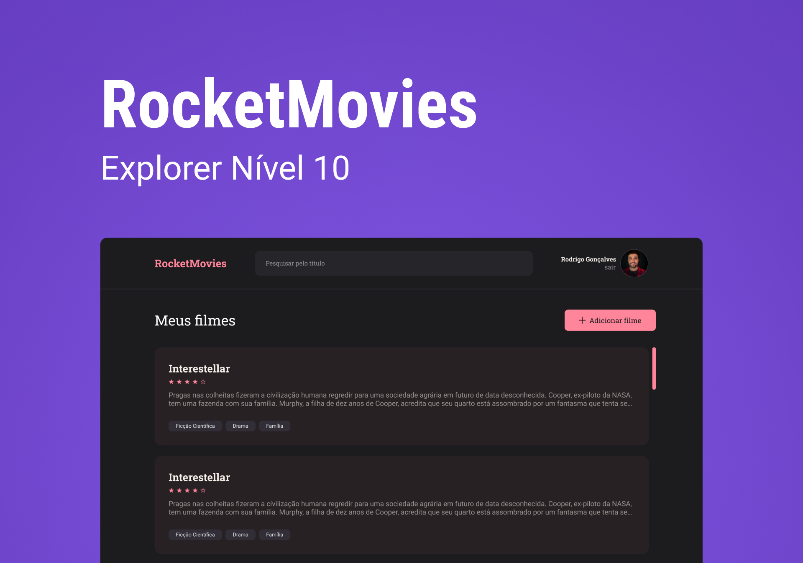

<h1 align="center"> Rocket Movie </h1>

Projeto exclusivo e gratuito, promovido pela Rocketseat dentro do curso EXPLORE para ensino de tecnologias WEB.  
<a target="_blank" href="https://lp.rocketseat.com.br/devlinks/inscricao?utm_source=github&utm_medium=descricao&utm_campaign=capture-devlinks&utm_term=organic&utm_content=descricao-github-mayk-brito">Estude esse projeto em formato de vídeo clicando aqui.</a>

  

 

  

## 🚀 Tecnologias

Esse projeto foi desenvolvido com as seguintes tecnologias:

- HTML e CSS
- React e Vite
- Git e Github
- Figma

## 💻 Projeto

O Rocket Movie é site voltado a usuários apaixonados por filmes que tem o desejo de ter uma lista dos seus filmes favoritos.

- [Acesse o projeto finalizado, online](https://xandguima.github.io/Recriando_layout_rocket.sectect/)

## 🔖 Layout

Você pode visualizar o layout do projeto através [DESSE LINK](https://www.figma.com/file/Z69IdgivPEcR1js8cmCdF4/RocketMovies-(Copy)?type=design&node-id=8%3A506&mode=dev). É necessário ter conta no [Figma](https://figma.com) para acessá-lo.

## :memo: Licença

Esse projeto está sob a licença MIT.

---

Feito com ♥ by Rocketseat :wave: [Participe da nossa comunidade!](https://discord.gg/rocketseat)
